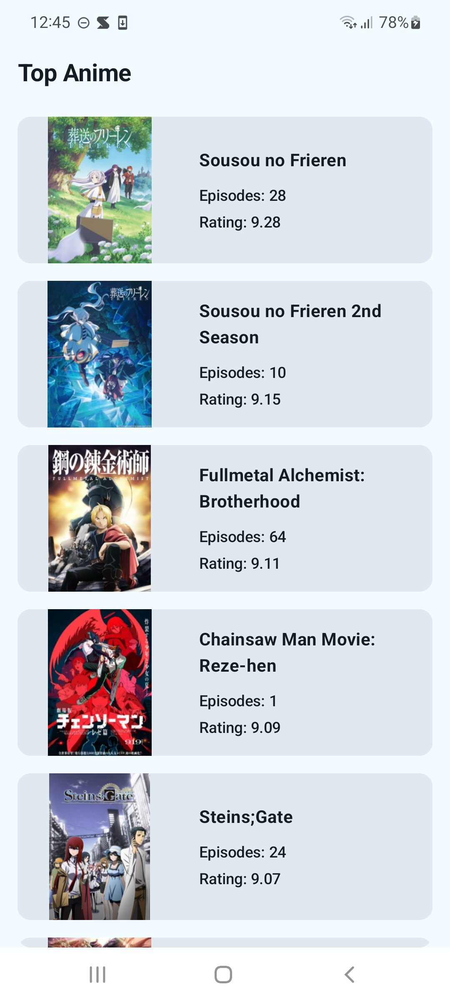
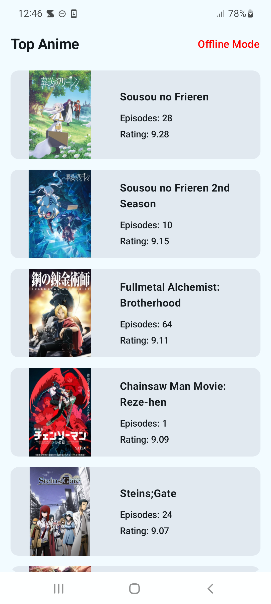
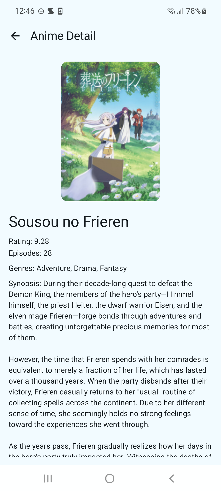
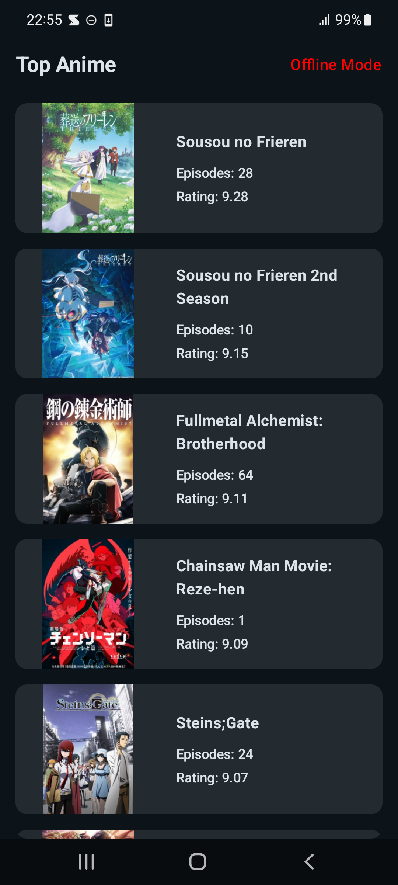
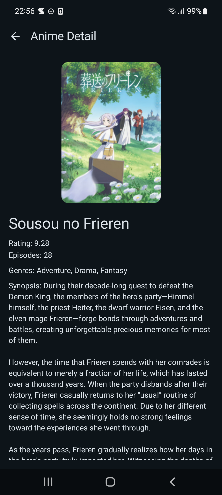

# Seekho Anime App

**Company:** Seekho  
**Project:** Seekho Anime App  
**Author:** Amit Bodaliya  
**GitHub:** [https://github.com/AmitBodaliya/SeekhoAssignment](https://github.com/AmitBodaliya/SeekhoAssignment)

---

## About the Project

The **Seekho Anime App** is an Android mobile application built using **Kotlin + Jetpack Compose**.  
This app fetches popular anime series from the **Jikan API** (MyAnimeList) and displays them in a clean, responsive UI. Users can browse the top anime, view details, watch trailers, and enjoy offline support via **Room database caching**.

The goal of this assignment was to demonstrate:

- Proper usage of **modern Android tech stack**  
- Clean **MVVM architecture**  
- Handling **pagination, offline caching, and error states**  
- Smooth, responsive **UI/UX using Jetpack Compose**  
- Network resilience and image caching  

---

## App Features

- **Anime List Screen**
  - Fetches top anime via Jikan API
  - Shows title, rating, episodes, poster image
  - Infinite scroll with **pagination**
  - Shimmer effect for loading placeholders
  - Offline support using **Room database**
- **Anime Detail Screen**
  - Displays anime details: title, synopsis, genres, main cast, episodes, rating
  - Plays trailer if available using **ExoPlayer**
  - Shows poster image as fallback
- **Network & Offline Handling**
  - Network connectivity indicator
  - Offline fallback using cached Room data
  - Error and empty state handling
- **Bonus Features**
  - Image caching for offline access
  - Clean, reusable composables for anime items
  - Modular repository & ViewModel architecture

---

## Installation & Setup

### Prerequisites
- Android Studio  
- JDK 11+  
- Git installed  
- Internet connection for first-time API & Gradle sync  

---

### Steps to Run the Project

1. Clone the repository 
```bash
git clone https://github.com/AmitBodaliya/SeekhoAssignment.git
```

2. 📂 Open Project in Android Studio

- Open **Android Studio**
- Click on **File → Open**
- Navigate to the cloned project folder
- Select the project and click **OK**

3. 🔄 Sync Gradle Dependencies
   
- Wait for Gradle sync to complete automatically
- If not started → Click **File → Sync Project with Gradle Files**

4. ▶️ Run the Project

- Connect an **Android Device** or start an **Android Emulator**
- Select device from the top device dropdown
- Click the **Run ▶ button**

The app will install and launch automatically.

---

## 📸 Screenshots, APK

## Screenshots

### Light Mode

All screenshots for Light Theme are stored in the `/files/` folder.

<p align="center">
  
  
  
</p>

### Dark Mode

All screenshots for Dark Theme are stored in the `/files/` folder.

<p align="center">
  
  
  
</p>

---

## APK Download (Android)

You can download and install the APK directly on your Android device:

**APK Link:**  
[SeekhoAssignment.apk](files/SeekhoAssignment.apk)

> ⚠️ Make sure to enable **Install from Unknown Sources** on your device before installing.

---

## 🛠 Technical Stack

### Frontend
- **Kotlin** – main programming language  
- **Jetpack Compose** – modern UI toolkit for Android  
- **AndroidX Libraries** – Material3, Navigation, Lifecycle, Room  
- **ExoPlayer** – for trailer video playback  
- **Coil** – image loading and caching  

### Architecture
- **MVVM (Model-View-ViewModel)** – separates UI, business logic, and data  
- **Repository Pattern** – centralizes API & database access  
- **Room Database** – offline caching of anime list and details  
- **StateFlow + Compose** – reactive UI updates  

### Tools & Libraries
- Android Studio (latest version recommended)  
- Gradle build system  
- Retrofit – API networking  
- Coil – image caching & offline support  
- Material3 UI Components  

---

## 🏗 Project Architecture

The project follows a **clean MVVM architecture**:

```text
com.abapp.seekhoassignment
│
├─ api/               # Retrofit API service
├─ data/
│  ├─ database/       # Room database and entities
│  └─ repository/     # Repository implementations (API + DB + Offline logic)
├─ model/             # Data models for API & DB
├─ ui/
│  ├─ component/      # Reusable Compose UI components
│  ├─ placeholder/    # Shimmer & loading placeholders
│  └─ screen/         # Composable screens (List, Detail, Splash, etc.)
└─ viewmodel/         # ViewModels for state management
```


## 📬 Contact Information

👤 **Author:** Amit Bodaliya  
📧 **Email:** amitbodaliyadev@gmail.com  
📞 **Phone:** +91 8570983776  

